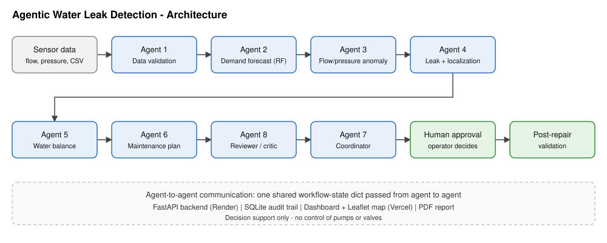

# Agentic AI Water Distribution Leak Detection & Resource Optimization

Live backend: https://water-leak-ai-j7h6.onrender.com
Live frontend: https://water-leak-ai-frontend-8nkb627vd-anjani123-hub.vercel.app/

Decision-support prototype for a water utility. It never operates pumps or valves; every action needs operator approval.

## 1. Problem and use case
Non-Revenue Water from leaks and bursts is hard to find with fixed thresholds. The system watches flow and pressure per District Metered Area (DMA), forecasts expected demand, and builds explainable leak hypotheses. Example: DMA-B inlet 510 m3/h vs 390 expected is NOT declared a leak until pressure, night flow and sensor health are checked.

## 2. Architecture

Sensor data -> Agent 1 validation -> Agent 2 forecast -> Agent 3 anomalies -> Agent 4 leak + localization -> Agent 5 water balance -> Agent 6 maintenance -> Agent 8 reviewer -> Agent 7 coordinator -> human approval -> post-repair validation.

## 3. Multi-agent design
| Agent | File function | Role |
|---|---|---|
| 1 Data monitoring | `a1_validate` | duplicates, impossible values (e.g. -3 bar excluded), invalid flow |
| 2 Forecasting | `a2_forecast` | RandomForest per DMA, features hour/day-of-week/sin/cos, 50-day train, 10-day validation, MAE/RMSE/MAPE |
| 3 Anomaly | `a3_anomaly` | forecast-residual z-score (>3 for 2+ hours), pressure drop vs hourly baseline (>0.5 bar), minimum night flow (01-04h) vs baseline mean+3 SD |
| 4 Leak/localization | `a4_leak` | weighted multi-sensor score; NetworkX path between upstream and downstream sensors gives the suspected pipe section |
| 5 Water balance | `a5_balance` | deterministic: inflow - expected consumption, % difference (simplified, not full IWA NRW) |
| 6 Maintenance | `a6_maintenance` | transparent weighted priority; no double assignment of teams |
| 7 Coordinator | `a7_coordinate` | recommendation, operator approval state, audit trail |
| 8 Reviewer | `a8_review` | flags unsupported claims and excluded sensors |

Shared state: a Python dict passed from agent to agent (`s`); agents are plain functions, so they can be wrapped as LangGraph nodes. **No LLM is used yet**, so there are no agent prompts; an LLM explanation layer is a possible extension. The LLM is never the forecasting model.

## 4. Methods
- **Why these anomaly methods:** residual z-score is simple, explainable and tied to the forecast; pressure and night-flow checks are standard DMA practice.
- **Leak confidence** = 0.35 flow + 0.30 pressure + 0.25 night flow + 0.10 stable upstream. >=0.8 High (Field Verification Required), >=0.5 Probable, >=0.3 Possible. A single isolated anomaly never reaches High.
- **Loss estimate** = sum of excess flow over forecast in anomalous hours (assumption printed with each estimate).
- **Priority** = 100 x (0.30 loss + 0.20 pressure + 0.15 duration + 0.25 confidence + 0.10 criticality), each factor scaled 0-1.
- **Localization:** only a suspected section is reported, never an exact point.
- **Dynamic reassessment:** `/api/reassess` re-runs with 3, 4, 5 hours of data and shows confidence changing.
- **Post-repair:** before/after night flow and pressure drop are reported; final verification stays with staff.

## 5. Data
Simulated in `app/data.py`: 3 DMAs, 60 days of hourly history, a leak in DMA-B from 02:00, a bad sensor in DMA-C. Scenarios: normal, leak, flow_only, pressure_only, bad_sensor. Own data: CSV with columns `ts,zone,flow,p_up,p_dn` via Upload CSV (`/api/sample.csv` shows the format).

## 6. Setup and run (macOS)
```bash
python3 -m venv .venv && source .venv/bin/activate
pip install -r requirements.txt
python -m pytest -q
uvicorn app.main:app          # http://127.0.0.1:8000, API docs at /docs
python -m scripts.gen_test_report   # regenerates docs/TEST_CASES.md
```
No environment variables are required. Optional: `WATER_DB` (SQLite path, default `water.db`).

## 6b. Frontend (React + TypeScript + Tailwind + Recharts + Leaflet)
13 pages in `frontend/src/App.tsx`: Water Operations Dashboard, Network Configuration, Live Network Map, Sensor Monitoring, Demand Forecasting, Leak Detection Center, Pressure & Flow Analytics, Water Balance, Field Operations, Maintenance Planning, AI Operations Center, Alert Center, Reports.
cd frontend && npm install && npm run dev    # http://localhost:5173 (backend on :8000)
Production: Vercel (root directory `frontend`). Backend URL is set in App.tsx.

## 7. API
`GET /api/run?scenario=` | `GET /api/reassess` | `POST /api/upload` | `GET /api/sample.csv` | `GET /api/report.pdf` | `GET /api/network` | `POST /api/approve/{leak}/{team}` | `POST /api/repair/{leak}` | `POST /api/teams/{id}` | `GET /api/state` | `GET /api/history`

## 8. Database
SQLite (`app/db.py`): `leaks` (current hypotheses) and `events` (audit trail). PostgreSQL/PostGIS is the production target.

## 9. Testing
`pytest` runs 12 automated tests. `docs/TEST_CASES.md` documents TC-01 to TC-08 (input, expected, actual, agents, forecast metrics, evidence, final state, pass/fail).

## 10. Known limitations
Simplified water balance; simulated data; synthetic map coordinates;  free-tier hosting (backend sleeps when idle, SQLite resets on restart); no authentication.